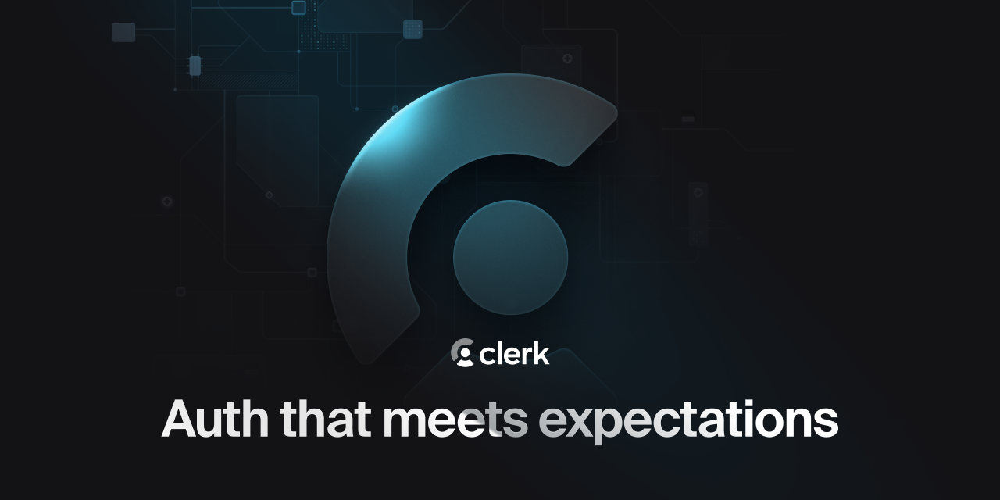

<p align="center">
  <a href="https://clerk.com?utm_source=github&utm_medium=owned" target="_blank" rel="noopener noreferrer">
    <picture>
      <source media="(prefers-color-scheme: dark)" srcset="./assets/light-logo.png">
      
    </picture>
  </a>
  <br />
</p>
<div align="center">
  <h1>
    Clerk and Chrome Extension Quickstart
  </h1>
  <a href="https://www.npmjs.com/package/@clerk/chrome-extension">
    
  </a>
  <a href="https://discord.com/invite/b5rXHjAg7A">
    
  </a>
  <a href="https://x.com/clerk">
    
  </a>
  <br />
  <br />
  
</div>

## Introduction

Clerk is a developer-first authentication and user management solution.It provides pre-built UI components and APIs for sign-in, sign-up, user profile, and organization management. Clerk is designed to be easy to use and customize, and can be dropped into any Chrome Extension application.

This is a Chrome extension demo using `@clerk/chrome-extension` with plain TypeScript. No Chrome extension frameworks (no WXT, Plasmo, CRXJS, etc.). Uses `pnpm build` (esbuild under the hood) to bundle the TypeScript source.

## Project structure

```
src/
  popup.ts              # TypeScript source (bundled to build/popup.js)
build/
  manifest.json         # Chrome extension manifest (Manifest V3)
  popup.html            # Popup page
  popup.css             # Popup styles
  icon*.png             # Icons for Extensions
  popup.js              # Bundled output (gitignored)
  popup.js.map          # Source Maps (gitignored)
.env.example            # Environment variable template
.env                    # Your publishable key (gitignored)
```

Static extension files (`manifest.json`, `popup.html`, `popup.css`) live directly in `build/` and are checked into git. The esbuild config automatically loads `.env`, replaces `process.env.CLERK_PUBLISHABLE_KEY` at build time, and bundles `src/popup.ts` into `build/popup.js`.

> [!IMPORTANT]
> This setup allows for the simplest example for this quickstart. For developing an extension, moving `manifest.json` and `popup.css` out of `build/` to `src/` or another location and then creating/copying/building these files during `pnpm dev` and `pnpm build` is likely preferred. Please don't take the initial project structure as advice on organizing your project.

## Running the template

```bash
git clone https://github.com/clerk/clerk-chrome-extension-js-quickstart
cd clerk-chrome-extension-js-quickstart
```

To run the example locally, you need to:

1. Sign up for a Clerk account at [https://clerk.com](https://dashboard.clerk.com/sign-up?utm_source=readme\&utm_medium=owned\&utm_campaign=chrome-extension\&utm_content=10-24-2023\&utm_term=clerk-chrome-extension-quickstart).

2. Go to the [Clerk dashboard](https://dashboard.clerk.com?utm_source=readme\&utm_medium=owned\&utm_campaign=chrome-extension\&utm_content=10-24-2023\&utm_term=clerk-chrome-extension-quickstart) and create an application.

3. Copy [`.env.example`](./.env.example) to `.env` file, then set the required Clerk environment variables.

4. `pnpm install` the required dependencies.

   The first time you install packages you may need to approve builds. Use:

   ```bash
   pnpm approve-builds
   ```

   > **Note:** `pnpm approve-builds` is interactive. If you need a non-interactive alternative, add the following to `package.json`. This list may need updating when dependencies change.
   >
   > ```json
   > "pnpm": {
   >   "onlyBuiltDependencies": [
   >     "@clerk/shared",
   >     "browser-tabs-lock",
   >     "bufferutil",
   >     "core-js",
   >     "esbuild",
   >     "utf-8-validate"
   >   ]
   > }
   > ```

5. Update `host_permissions` in `build/manifest.json`. Add your Clerk Frontend API domain so the extension can send cookies and authenticate with Clerk. You can get your Frontend API URL from the [API Keys](https://dashboard.clerk.com/~/api-keys) section of the [Clerk Dashboard](https://dashboard.clerk.com/).

   ```json
   "host_permissions": [
     "http://localhost/*",
     "https://your-app-42.clerk.accounts.dev/*"
   ]
   ```

6. `pnpm dev` to start the file watcher.

7. Load the extension in Chrome:
   1. Open `chrome://extensions/`
   2. Enable **Developer mode** (top right)
   3. Click **Load unpacked**
   4. Select the `build/` directory inside this project

## Learn more

To learn more about Clerk and Chrome Extensions, check out the following resources:

* [Quickstart: Get started with JS Chrome Extension and Clerk](https://clerk.com/docs/getting-started/quickstart/chrome-extension-js?utm_source=readme\&utm_medium=owned\&utm_campaign=chrome-extension\&utm_content=10-24-2023\&utm_term=clerk-chrome-extension-quickstart)
* [Clerk Documentation](https://clerk.com/docs?utm_source=readme\&utm_medium=owned\&utm_campaign=chrome-extension\&utm_content=10-24-2023\&utm_term=clerk-chrome-extension-quickstart)
* [Chrome Extensions](https://developer.chrome.com/docs/extensions)

## Found an issue or want to leave feedback

Feel free to create a support thread on our [Discord](https://clerk.com/discord). Our support team will be happy to assist you in the `#support` channel.

## Connect with us

You can discuss ideas, ask questions, and meet others from the community in our [Discord](https://discord.com/invite/b5rXHjAg7A).

If you prefer, you can also find support through our [X account](https://x.com/clerk), or you can [email](mailto:support@clerk.dev) us!
